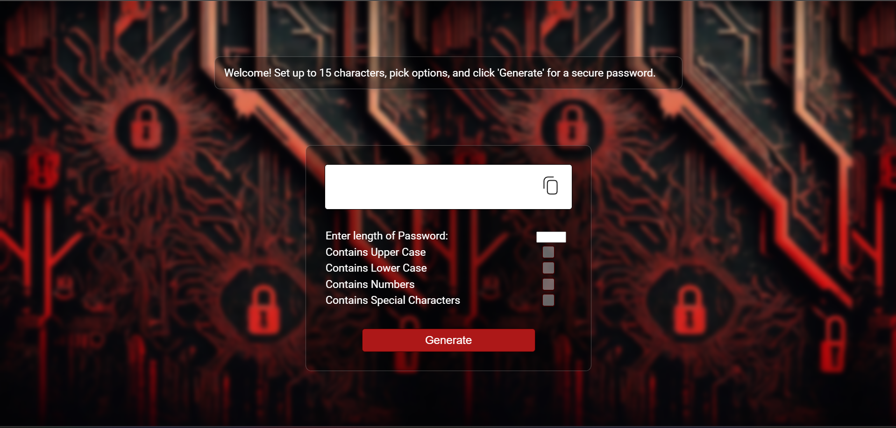

# Random Password Generator

This is a simple and functional **Random Password Generator** created using **HTML**, **CSS**, and **JavaScript**. The application allows users to generate secure, random passwords with customizable options to meet various security requirements.

## Features
- **Generate Random Password**: Click the button to generate a secure password.
- **Customizable Length**: Choose the length of the generated password (e.g., 8 to 20 characters).
- **Include Special Characters**: Option to include symbols like `!@#$%^&*` for added complexity.
- **Include Numbers**: Option to include numeric digits in the password.
- **Include Uppercase and Lowercase Letters**: Options to include both uppercase and lowercase letters for varied security.

## Technologies Used
- **HTML**: Markup for the structure of the page.
- **CSS**: Styling to ensure the page is visually appealing and responsive.
- **JavaScript**: Logic for generating the random password based on user preferences.

## How to Use
1. Open the `index.html` file in a web browser.
2. Use the checkboxes to select or deselect password features (special characters, numbers, uppercase letters, etc.).
3. Set the desired password length.
4. Click the "Generate Password" button to create a secure password.
5. Copy the generated password for your use.

## Demo

You can view the live demo of the Random Password Generator [here](https://devanshtyagi26.github.io/RandomPasswordGenerator/).

## Author

Devansh Tyagi
